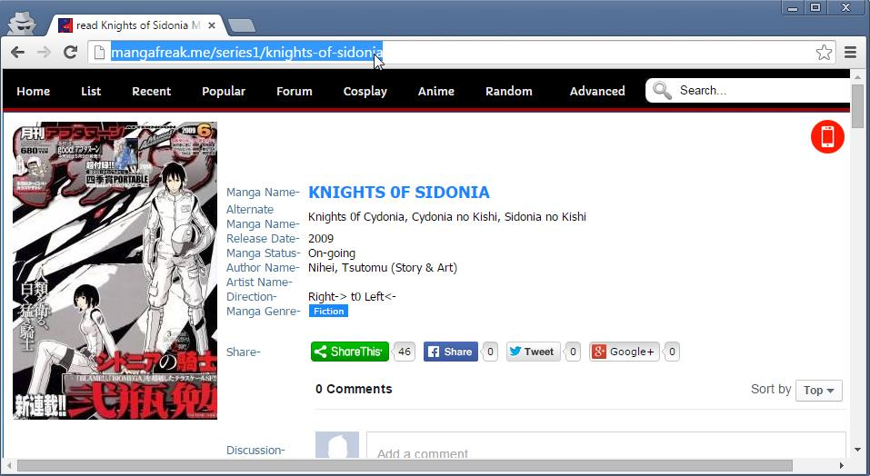

# scan-dl-2

Extract and download full online manga from websites like http://mangafreak.me/.

## Get Started

Install Python 3, pip

```bash
pip install -r requirements.txt --force-reinstall

python -m unittest tests/mangahere_plugin_test.py
```

## Usage

Note: for all-in-one usage use `src/main.py`.

* accept security exception for phantomjs browser
* wait for ending...
* get the result in generated target folder

## Example

URLs for MangaFreak
* This URL will download the serie: http://mangafreak.me/series1/knights-of-sidonia
* This URL will download the chapter: http://mangafreak.me/read1/knights-of-sidonia/1

URLs for MangaHere
* This URL will download the serie: http://www.mangahere.co/manga/sidonia_no_kishi/
* This URL will download the chapter: http://www.mangahere.co/manga/sidonia_no_kishi/v01/c000/

## Example for a serie



## Resources

